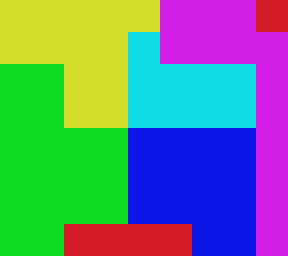

# CoulAdj-TestSamples

This repository contains elaborate images meant to be used to test the correctness
of an implementation of CoulAdj.

These images were created because previously, the images used to test the performance
were proprietary and couldn't be freely distributed.

All samples should produce the same output, and this output should be identical, 
line by line, to `golden.tsv`. (The line endings may differ depending on the 
platform where the output was produced.)

# Preview

The sample of size 1 looks like the image below. This preview is 32 times
bigger than the actual sample.

Actual size: 

NB: In all samples, the top-right cell was made to always be 1 by 1 pixel.
This is why you can hardly see the red in the top-right when looking at the bigger
samples.

# Sizes
In the preview, you can see that the colours are assigned by squares. We will
call these squares "cells".

The "size" of a sample is the length of a cell in pixels. Since the sample
is a grid of 9 by 8 cells, the sample of size 1 is 9 by 8 pixels. The
sample of size 2 is 18 by 16 pixels, etc etc...

The size closest to the intended real-world use-case is 512, with ~18M pixels.
As such, execution time at size 512 is the "canonical" metric, 
and it should be used when comparing different implementations.

More exhaustively:

| Size | Width | Height |  Nb Pixels | Canonical? |
|-----:|------:|-------:|-----------:|:----------:|
|    1 |     9 |      8 |         72 |
|    2 |    18 |     16 |        288 |
|    4 |    36 |     32 |      1,152 |
|    8 |    72 |     64 |      4,608 |
|   16 |   144 |    128 |     18,432 |
|   32 |   288 |    256 |     73,728 |
|   64 |   576 |    512 |    294,912 |
|  128 |  1152 |   1024 |  1,179,648 |
|  256 |  2304 |   2048 |  4,718,592 |
|  **512** |  **4608** |   **4096** | **18,874,368** | Yes |
| 1024 |  9216 |   8192 | 75,497,472 |

The high amount of sizes is meant to verify if the implementation went
[quadratic](https://en.wikipedia.org/wiki/Time_complexity#Sub-quadratic_time) 
in languages with a slow execution time. (Our best Power Query implementation to date
takes a whooping 8 minutes. And yes, this is sub-quadratic.)

If a size takes more than about 4 times then what the previous size took to
complete, the implementation is likely of quadratic complexity or worse.

# Correct results
The correct results, _with additional columns to name the colours_, 
for all samples is this:

|   r |   g |   b |   a | adj_r | adj_g | adj_b | adj_a | Colour  | adj_Colour |
|----:|----:|----:|----:|------:|------:|------:|------:|---------|------------|
|  10 |  20 | 230 | 252 |    10 |   220 |    30 |   250 | Blue    | Green      |
|  10 |  20 | 230 | 252 |    10 |   220 |   230 |   248 | Blue    | Cyan       |
|  10 |  20 | 230 | 252 |   210 |    20 |    30 |   246 | Blue    | Red        |
|  10 |  20 | 230 | 252 |   210 |    20 |   230 |   244 | Blue    | Magenta    |
|  10 |  20 | 230 | 252 |   210 |   220 |    30 |   242 | Blue    | Yellow     |
|  10 | 220 |  30 | 250 |    10 |    20 |   230 |   252 | Green   | Blue       |
|  10 | 220 |  30 | 250 |    10 |   220 |   230 |   248 | Green   | Cyan       |
|  10 | 220 |  30 | 250 |   210 |    20 |    30 |   246 | Green   | Red        |
|  10 | 220 |  30 | 250 |   210 |   220 |    30 |   242 | Green   | Yellow     |
|  10 | 220 | 230 | 248 |    10 |    20 |   230 |   252 | Cyan    | Blue       |
|  10 | 220 | 230 | 248 |    10 |   220 |    30 |   250 | Cyan    | Green      |
|  10 | 220 | 230 | 248 |   210 |    20 |   230 |   244 | Cyan    | Magenta    |
|  10 | 220 | 230 | 248 |   210 |   220 |    30 |   242 | Cyan    | Yellow     |
| 210 |  20 |  30 | 246 |    10 |    20 |   230 |   252 | Red     | Blue       |
| 210 |  20 |  30 | 246 |    10 |   220 |    30 |   250 | Red     | Green      |
| 210 |  20 |  30 | 246 |   210 |    20 |   230 |   244 | Red     | Magenta    |
| 210 |  20 | 230 | 244 |    10 |    20 |   230 |   252 | Magenta | Blue       |
| 210 |  20 | 230 | 244 |    10 |   220 |   230 |   248 | Magenta | Cyan       |
| 210 |  20 | 230 | 244 |   210 |    20 |    30 |   246 | Magenta | Red        |
| 210 |  20 | 230 | 244 |   210 |   220 |    30 |   242 | Magenta | Yellow     |
| 210 | 220 |  30 | 242 |    10 |    20 |   230 |   252 | Yellow  | Blue       |
| 210 | 220 |  30 | 242 |    10 |   220 |    30 |   250 | Yellow  | Green      |
| 210 | 220 |  30 | 242 |    10 |   220 |   230 |   248 | Yellow  | Cyan       |
| 210 | 220 |  30 | 242 |   210 |    20 |   230 |   244 | Yellow  | Magenta    |

# Rules

Each test samples obey these rules:
1. Width and height are different.
1. Values in the red channel must be either 10 or 210
1. Values in the green channel must be either 20 or 220
1. Values in the blue channel must be either 30 or 230
1. Values in the alpha channel (if present) must be between 240 and 254 (inclusive).
Additionally, the alpha value must represent a unique RGB combination.
1. More specifically, only these colours are allowed:
    |   r |   g |   b |   a | Name    | ID | r (hex) | g (hex) | b (hex) | a (hex) |
    |----:|----:|----:|----:|---------|----|--------:|--------:|--------:|--------:|
    |  10 |  20 | 230 | 252 | Blue    | 52 |  0a     |  14     |  e6     |  fc     |
    |  10 | 220 |  30 | 250 | Green   | 50 |  0a     |  dc     |  1e     |  fa     |
    |  10 | 220 | 230 | 248 | Cyan    | 48 |  0a     |  dc     |  e6     |  f8     |
    | 210 |  20 |  30 | 246 | Red     | 46 |  d2     |  14     |  1e     |  f6     |
    | 210 |  20 | 230 | 244 | Magenta | 44 |  d2     |  14     |  e6     |  f4     |
    | 210 | 220 |  30 | 242 | Yellow  | 42 |  d2     |  dc     |  1e     |  f2     |
1. When looking at the image from top-left to top-right, from top to bottom,
the colours must appear such that those with the lower alpha values appear first.

# Rationales

The rules regarding what colour is allowed were designed to accomplish these goals:

## Correct ordering of RGBA columns

The old test samples we created had values of either 0 or 255 in all channels. This complicated verifying
that the program had correctly identified the RGBA channels. 

Now, you can tell to which channel a value belongs by looking at the tens digit of
the value. If it's 1 (10 or 210), then red. 2 is green, 3 is blue, and 4 & 5 are alpha.

This is the same order the columns should be appearing in the output, and also the
same order that must be used when comparing the colours to sort them.

## Quick identification of what colour a pixel should be.

Since the alpha value is unique for each colour, we only need to look at the alpha
to know which colour is supposed to be represented by this pixel.

Before, we had to order and compare the 0s and 255s from all 3 RGB channels.

> For example, compare (0,255,255,255) vs (255,255,0,255). Can you tell which is yellow and which
> is cyan? 
>
> Now, we have (10,220,230,248) vs (210,220,30,242), and you only need to
> know that cyan is 248 and yellow is 242.

## Correct sorting of colours

We want the sort to be done by channels. ie, (10, 20, 230) must appear (in the ouput)
before (10, 220, 30). This is why we only encoded the ID of the colour in the alpha
channel. Had we encoded all the channels, these two colours would then be something
like (16, 26, 236) and (15, 225, 35), making that specifications unverifiable.

Furthermore, the IDs to encode in the alpha channel were chosen so that if the
output had been sorted, then we only need to check the `a` column is also sorted.

However, we didn't want this encoding to have an impact on the sorting itself,
so the IDs were chosen so that the alpha column should always be sorted from 
greater to lower value. This way, if the alpha was ever used to sort 2 colours,
it would be visible in the ouput.

## A sort was actually performed

Some languages use structures that remember the order of insertion. To verify
that the output was actually sorted and isn't depending on the insertion order,
the images are made so that the insertion order would give an obviously incorrect
result, because it would interfere with the expected ordering of the alpha column.

# Rules of thumb

When looking at the output...
* In each row, the digit of the tens should always be increasing from left column to right column.
* In the first alpha column (`a`), each row should have a value greater or equal than the row below.
* In the second alpha column (`adj_a`), the above should be true when grouping rows by `a` value.